# 🔐 Explicación Completa: EDITAR vs ANULAR Facturas

## 📋 **Resumen de Funcionalidades**

| Acción | Endpoint | Estados Permitidos | Validación Usuario |
|--------|----------|-------------------|-------------------|
| **EDITAR** | `PUT/PATCH /api/facturas/{id}/` | Solo `BORRADOR` | ✅ Solo creador/admin |
| **ANULAR** | `POST /api/facturas/{id}/anular_factura/` | `EMITIDA`, `PAGADA` | ✅ Solo creador/admin |

---

## ✏️ **1. EDITAR Facturas**

### **¿Cuándo se puede editar?**
```python
def puede_editar(self):
    """Una factura solo puede editarse si está en estado BORRADOR"""
    return self.estado == 'BORRADOR'
```

### **¿Quién puede editar?**
```python
def puede_editar_usuario(self, user):
    """
    Solo pueden editar:
    - El usuario que la creó (self.creador == user)
    - Un usuario con rol Administrador 
    - Superusuarios
    Y además debe estar en estado BORRADOR
    """
    if not self.puede_editar():  # Debe estar en BORRADOR
        return False
    
    if user.is_superuser:        # Superuser ✅
        return True
    if user.role == 'Administrador':  # Admin ✅
        return True 
    if self.creador == user:     # Creador ✅
        return True
    return False                 # Otros ❌
```

### **Validación en la vista:**
```python
def perform_update(self, serializer):
    instance = self.get_object()
    if not instance.puede_editar_usuario(self.request.user):
        if not instance.puede_editar():
            raise PermissionDenied("No se puede editar una factura que ya ha sido emitida")
        else:
            raise PermissionDenied("Solo el creador de la factura o un Administrador pueden editarla")
    serializer.save()
```

### **Ejemplo de uso:**
```bash
# ✅ PERMITIDO - Creador edita su factura en borrador
PATCH /api/facturas/1/
Authorization: Token <creador_token>
{
  "cliente": 2
}
# Respuesta: 200 OK

# ❌ BLOQUEADO - Otro usuario intenta editar
PATCH /api/facturas/1/  
Authorization: Token <otro_usuario_token>
# Respuesta: 403 "Solo el creador de la factura o un Administrador pueden editarla"

# ❌ BLOQUEADO - Factura ya emitida
PATCH /api/facturas/1/  # (estado: EMITIDA)
# Respuesta: 403 "No se puede editar una factura que ya ha sido emitida"
```

---

## 🚫 **2. ANULAR Facturas**

### **¿Cuándo se puede anular?**
```python
def puede_anular(self):
    """Una factura puede anularse si está EMITIDA o PAGADA"""
    return self.estado in ['EMITIDA', 'PAGADA']
```

### **¿Quién puede anular?**
```python
def puede_anular_usuario(self, user):
    """
    Solo pueden anular:
    - El usuario que la creó (self.creador == user)
    - Un usuario con rol Administrador
    - Superusuarios  
    Y además debe estar en estado EMITIDA o PAGADA
    """
    if not self.puede_anular():  # Debe estar EMITIDA o PAGADA
        return False
    
    if user.is_superuser:        # Superuser ✅
        return True
    if user.role == 'Administrador':  # Admin ✅
        return True
    if self.creador == user:     # Creador ✅
        return True
    return False                 # Otros ❌
```

### **¿Qué hace anular?**
```python
def anular(self):
    """
    Anular una factura y restituir el stock de todos los productos.
    Usa transacciones atómicas para garantizar consistencia.
    """
    if self.puede_anular():
        with transaction.atomic():
            # 1. Restituir stock de todos los items
            for item in self.items.all():
                producto = item.producto
                producto.stock += item.cantidad  # ⬆️ Devolver stock
                producto.save()
            
            # 2. Cambiar estado de la factura
            self.estado = 'ANULADA'
            self.anulada = True  # Por compatibilidad
            self.save()
            
            return True
    return False
```

### **Validación en la vista:**
```python
@action(detail=True, methods=['post'])
def anular_factura(self, request, pk=None):
    factura = self.get_object()
    
    # Verificar permisos de usuario
    if not factura.puede_anular_usuario(request.user):
        if not factura.puede_anular():
            return Response({
                "error": f"Esta factura no puede ser anulada. Estado actual: {factura.get_estado_display()}"
            }, status=400)
        else:
            return Response({
                "error": "Solo el creador de la factura o un Administrador pueden anularla"
            }, status=403)
    
    # Proceder con anulación...
```

### **Ejemplo de uso:**
```bash
# ✅ PERMITIDO - Creador anula su factura emitida
POST /api/facturas/1/anular_factura/
Authorization: Token <creador_token>
# Respuesta: 200 OK + stock restituido

# ❌ BLOQUEADO - Otro usuario intenta anular
POST /api/facturas/1/anular_factura/
Authorization: Token <otro_usuario_token>  
# Respuesta: 403 "Solo el creador de la factura o un Administrador pueden anularla"

# ❌ BLOQUEADO - Factura en borrador
POST /api/facturas/1/anular_factura/  # (estado: BORRADOR)
# Respuesta: 400 "Esta factura no puede ser anulada. Estado actual: Borrador"
```

---

## 🔄 **3. Flujo de Estados y Permisos**

```mermaid
graph TD
    A[Crear Factura] --> B[BORRADOR]
    B --> C{¿Editar?}
    C -->|Creador/Admin| D[✅ PUEDE EDITAR]
    C -->|Otros| E[❌ NO PUEDE EDITAR]
    B --> F[Emitir]
    F --> G[EMITIDA]
    G --> H{¿Anular?}
    H -->|Creador/Admin| I[✅ PUEDE ANULAR]
    H -->|Otros| J[❌ NO PUEDE ANULAR]
    G --> K[Marcar Pagada]
    K --> L[PAGADA]
    L --> M{¿Anular?}
    M -->|Creador/Admin| N[✅ PUEDE ANULAR]
    M -->|Otros| O[❌ NO PUEDE ANULAR]
    I --> P[ANULADA - Stock Restituido]
    N --> P
```



---

## 📊 **4. Matriz de Permisos Completa**

| Usuario | Editar BORRADOR (propia) | Editar BORRADOR (ajena) | Anular EMITIDA (propia) | Anular EMITIDA (ajena) |
|---------|-------------------------|------------------------|------------------------|------------------------|
| **Creador** | ✅ SÍ | ❌ NO | ✅ SÍ | ❌ NO |
| **Administrador** | ✅ SÍ | ✅ SÍ | ✅ SÍ | ✅ SÍ |
| **Superuser** | ✅ SÍ | ✅ SÍ | ✅ SÍ | ✅ SÍ |
| **Otro Ventas** | ❌ NO | ❌ NO | ❌ NO | ❌ NO |

---

## 🛡️ **5. Mensajes de Error**

### **Editar:**
- `"No se puede editar una factura que ya ha sido emitida"` (Estado incorrecto)
- `"Solo el creador de la factura o un Administrador pueden editarla"` (Usuario sin permisos)

### **Anular:**
- `"Esta factura no puede ser anulada. Estado actual: Borrador"` (Estado incorrecto)
- `"Solo el creador de la factura o un Administrador pueden anularla"` (Usuario sin permisos)

---

**🎯 CONCLUSIÓN: Ambas operaciones ahora están completamente protegidas - solo el creador o administradores pueden editarlas/anularlas!**
