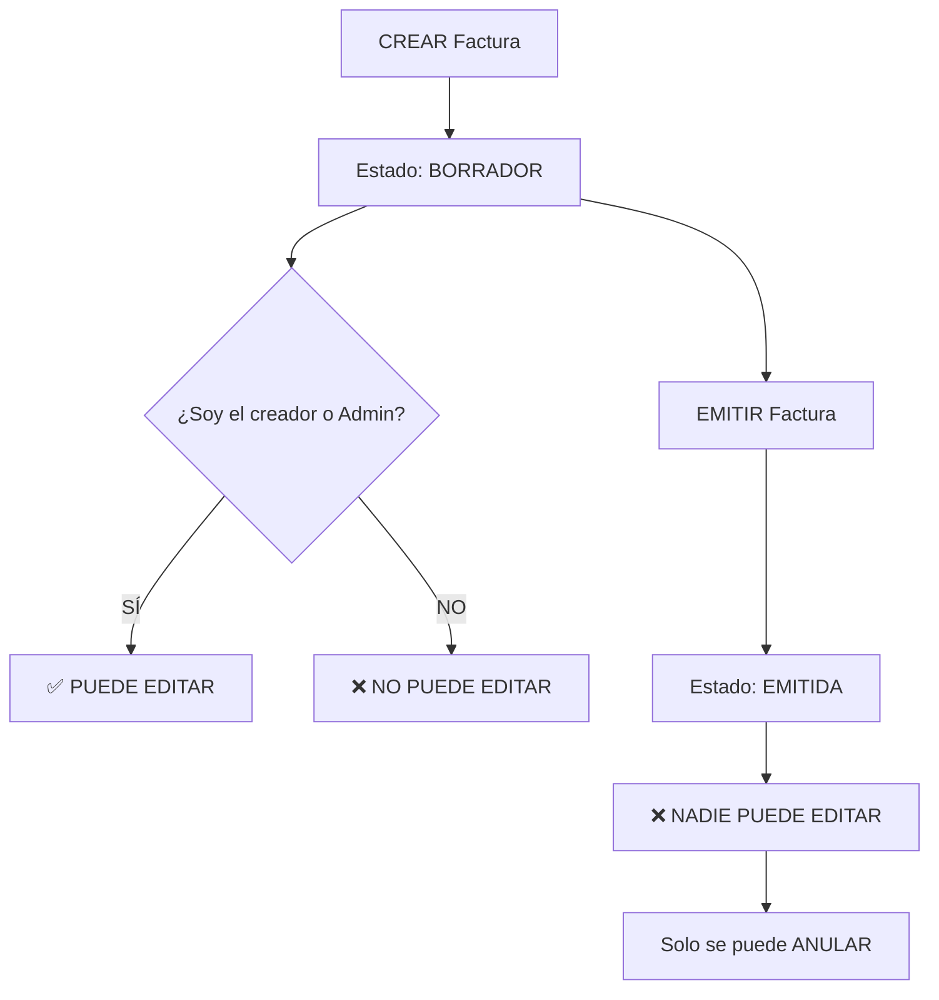

# 🔐 Actualización de Seguridad - Edición de Facturas

## ✅ **NUEVA VALIDACIÓN IMPLEMENTADA**

Se ha agregado validación de permisos para la **edición de facturas**, asegurando que solo el **creador** o un **Administrador** puedan editarlas.

---

## 🛡️ **Respuesta a tu pregunta:**

### ❓ **"¿Está validado para que únicamente quien la creó la pueda editar?"**

### ✅ **SÍ, AHORA ESTÁ VALIDADO**

**Antes:** Solo validaba estado (BORRADOR vs EMITIDA)  
**Ahora:** Valida estado + permisos de usuario

---

## 🔧 **Implementación Técnica**

### 1. **Nuevo método en modelo Factura:**
```python
def puede_editar_usuario(self, user):
    """
    Determina si un usuario puede editar esta factura.
    Solo pueden editar:
    - El usuario que la creó
    - Un usuario con rol Administrador  
    - Superusuarios
    Y además debe estar en estado BORRADOR
    """
```

### 2. **Actualización en vistas:**
```python
def perform_update(self, serializer):
    instance = self.get_object()
    if not instance.puede_editar_usuario(self.request.user):
        if not instance.puede_editar():
            raise PermissionDenied("No se puede editar una factura que ya ha sido emitida")
        else:
            raise PermissionDenied(
                "Solo el creador de la factura o un Administrador pueden editarla"
            )
    serializer.save()
```

---

## 📋 **Matriz de Permisos para Edición**

| Usuario | Factura BORRADOR (propia) | Factura BORRADOR (de otro) | Factura EMITIDA |
|---------|---------------------------|----------------------------|-----------------|
| **Creador** | ✅ PUEDE editar | ❌ NO puede editar | ❌ NO puede editar |
| **Administrador** | ✅ PUEDE editar | ✅ PUEDE editar | ❌ NO puede editar |
| **Superuser** | ✅ PUEDE editar | ✅ PUEDE editar | ❌ NO puede editar |
| **Otro rol Ventas** | ❌ NO puede editar | ❌ NO puede editar | ❌ NO puede editar |

---

## 🚨 **Casos de Error**

### 1. **Usuario intenta editar factura de otro:**
```bash
PATCH /api/facturas/1/
# Respuesta: 403 Forbidden
{
  "detail": "Solo el creador de la factura o un Administrador pueden editarla"
}
```

### 2. **Usuario intenta editar factura emitida:**
```bash
PATCH /api/facturas/1/
# Respuesta: 403 Forbidden  
{
  "detail": "No se puede editar una factura que ya ha sido emitida"
}
```

---

## ✅ **Casos de Éxito**

### 1. **Creador edita su factura en borrador:**
```bash
PATCH /api/facturas/1/
Authorization: Token <creador_token>
# Respuesta: 200 OK ✅
```

### 2. **Admin edita cualquier factura en borrador:**
```bash
PATCH /api/facturas/1/
Authorization: Token <admin_token>
# Respuesta: 200 OK ✅
```

---

## 🧪 **Tests Verificados**

✅ **7 tests pasan exitosamente:**
- `test_creador_puede_editar_factura_borrador`
- `test_admin_puede_editar_factura_borrador`
- `test_otro_usuario_no_puede_editar_factura_borrador`
- `test_creador_no_puede_editar_factura_emitida`
- `test_admin_no_puede_editar_factura_emitida`
- `test_superuser_puede_editar_factura_borrador`
- `test_superuser_no_puede_editar_factura_emitida`

---

## 🔄 **Flujo de Vida de una Factura**



---

## 💻 **Uso Práctico**

### **Frontend debe manejar:**

```javascript
// Verificar si puede editar antes de mostrar botón
const puedeEditar = (factura, usuario) => {
    return factura.estado === 'BORRADOR' && 
           (factura.creador === usuario.id || usuario.role === 'Administrador');
};

// Mostrar/ocultar botón de editar
if (puedeEditar(factura, currentUser)) {
    showEditButton();
} else {
    hideEditButton();
}
```

---

**🎯 CONCLUSIÓN: SÍ, ahora está completamente validado que solo el creador o administradores pueden editar facturas!**
